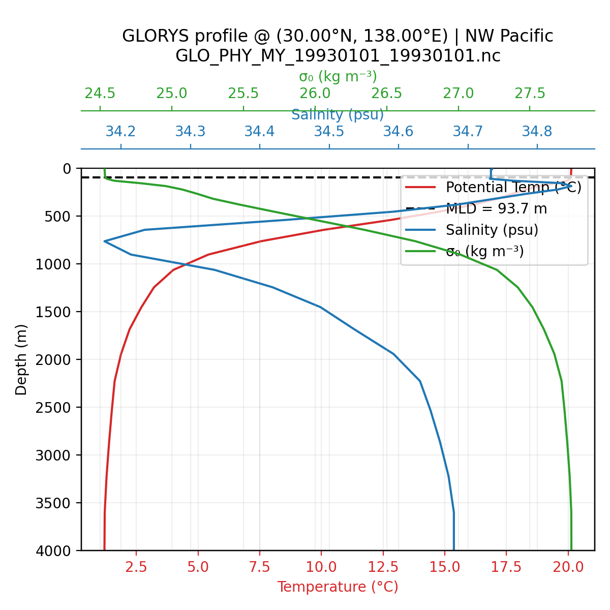

# 혼합층 프로파일 확인 (GLORYS, 1993-01-01)

혼합층 정의(`mlotst`: density-based, 10 m reference, Δθ≈0.2 °C equivalence)가 실제 수직 구조와 부합하는지 확인하기 위해, GLORYS 일별 파일(`GLO_PHY_MY_19930101_19930101.nc`)에서 대표 지점을 골라 온도·염분·σ₀ 프로파일을 시각화했습니다. 아래 이미지를 클릭하면 VS Code 이미지 뷰어로 바로 열립니다.

## East China Sea (27.5°N, 125.0°E)

- 혼합층 깊이: `mlotst ≈ 99 m`
- 표층 대비 혼합층 하단 σ₀ 증가를 통해 밀도 기반 정의가 유지되는지 확인

## Northwestern Pacific (30.0°N, 138.0°E)

### 전체 수심 프로파일

### 상부 200 m 확대

- 혼합층 깊이: `mlotst ≈ 94 m`
- σ₀ 차이는 ~0.016 kg m⁻³ 수준으로, GLORYS 문서에서 언급한 0.2 °C 등가 밀도 증가와 일치함을 확인

> 참고: 이미지가 열리지 않을 경우, 탐색기에서 `figures/` 디렉터리로 이동해 직접 더블클릭하거나 `open <경로>` 명령을 사용하세요.

