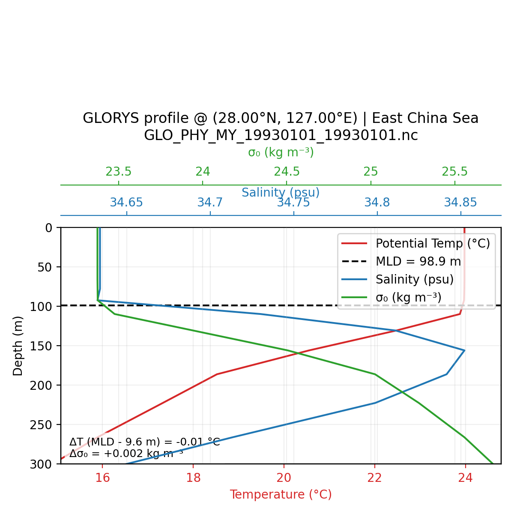
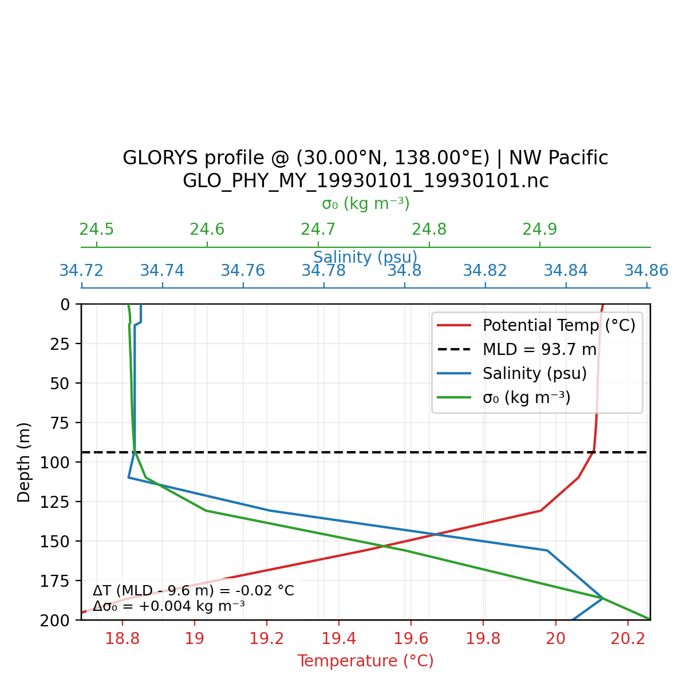

# 혼합층 프로파일 확인 (GLORYS, 1993-01-01) — moved

> 안내: 본 문서는 MLHB 전용 프로젝트로 이동했습니다(위치 안내: MLHB/docs/heat_budget/mld_profiles.md). 여기서는 요약 및 링크만 유지합니다.

혼합층 정의(`mlotst`: density-based, 10 m reference, Δθ≈0.2 °C equivalence)가 실제 수직 구조와 부합하는지 확인하기 위해, GLORYS 일별 파일(`GLO_PHY_MY_19930101_19930101.nc`)에서 대표 지점을 골라 온도·염분·σ₀ 프로파일을 시각화했습니다. 아래 이미지를 클릭하면 VS Code 이미지 뷰어로 바로 열립니다.

## East China Sea (28.0°N, 127.0°E)

- 혼합층 깊이: `mlotst ≈ 112 m`
- 표층 대비 혼합층 하단 σ₀ 증가를 통해 밀도 기반 정의가 유지되는지 확인

## Northwestern Pacific (30.0°N, 138.0°E)

### 전체 수심 프로파일

### 상부 200 m 확대

- 혼합층 깊이: `mlotst ≈ 94 m`
- σ₀ 차이는 0.01–0.05 kg m⁻³ 정도로, 실제 GLORYS 제품(`mlotst`)이 10 m 대비 작은(≈0.01–0.1 °C) 밀도 증가에서 혼합층을 정의하고 있음을 보여 준다. Copernicus 문서 일부에는 0.2 °C 기준이 언급되어 있으므로, 버전별 정의를 확인한 뒤 사용해야 한다.

> 참고: 이미지가 열리지 않을 경우, 탐색기에서 `figures/` 디렉터리로 이동해 직접 더블클릭하거나 `open <경로>` 명령을 사용하세요.
